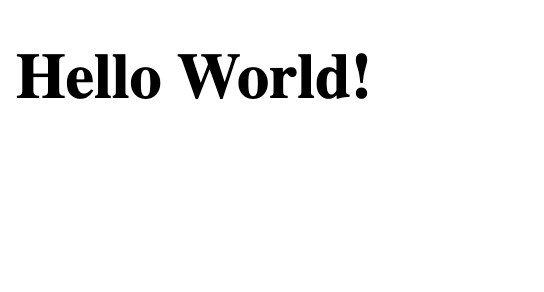
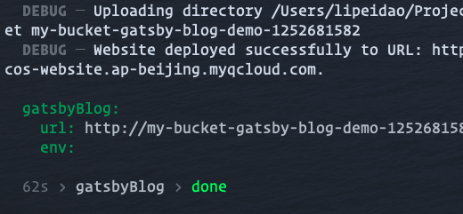

## 一、创建 github 仓库

在 .gitignore 中选择 node 项目，可以帮助我们节省许多时间

```bash
git clone https://github.com/lipd/serverless-gatsby-blog.git
```

## 二、进行开发环境配置

使用 yarn 初始化 package.json 文件

```bash
yarn init
```

生成 package.json 文件之后，我们进行基本的依赖安装：

```bash
yarn add react react-dom gatsby
yarn add prettier --dev
```

编写 package.json 的脚本命令

```json
// package.json

{
  "name": "serverless-gatsby-blog",
  "version": "0.1.0",
  "description": "a gatsby blog with tencent serverless",
  "repository": "git@github.com:lipd/serverless-gatsby-blog.git",
  "author": "lipd <lipeidao@gmail.com>",
  "license": "MIT",
  "private": true,
  "dependencies": {
    "gatsby": "^2.20.14",
    "react": "^16.13.1",
    "react-dom": "^16.13.1"
  },
  "devDependencies": {
    "prettier": "^2.0.4"
  },
  "scripts": {
    "build": "gatsby build",
    "develop": "GATSBY_GRAPHQL_IDE=playground gatsby develop",
    "format": "prettier --write src/**/*.{js,jsx}",
    "start": "npm run develop"
  }
}
```

由于我们的项目使用了 prettier 来进行基本的格式约束，所以我们还需要配置 .prettierrc 文件

```json
// .prettierrc

{
  "semi": false,
  "singleQuote": true,
  "tabWidth": 2,
  "trailingComma": "all"
}
```

将 .gitignore 中的 pulic 前面的注释取消掉

```bash
# .gitignore

# Comment in the public line in if your project uses Gatsby and *not* Next.js
# https://nextjs.org/blog/next-9-1#public-directory-support
public
```

## 三、创建你的第一个页面

gatsby 会将 `src/pages` 页面下的文件转换为页面，所以我们在该目录下创建一个名为 `index.js`的文件，Gatsby 会将其作为网站主页。

```js
// src/pages/index.js

import React from 'react'

export default () => (
  <>
    <h1>Hello World!</h1>
  </>
)
```

我们运行一下 npm start 命令，可以看到网站可以正常运行了。



## 四、部署网站（可选）

你没有看错，由于 Gatsby 可以作为静态网站生成器，我们此时就可以将这个还十分粗陋的项目部署在云端了。如果你现在还不想部署这个项目，也可以安心地跳过这一步，我们会在最后一章专门来讲解部署相关的问题。

这里我们选择使用腾讯云的 serverless 功能进行部署，这可能是目前最方便的将静态网站方式部署到国内公共云上的方式。首先你需要注册一个腾讯云账号，并且安装 Serverless Framework 命令行工具：

```bash
npm i -g serverless
```

之后我们就可以创建配置 serverless 的 serverless.yml 文件了

```yml
# serverless.yml

gatsbyBlog:
  component: '@serverless/tencent-website'
  inputs:
    code:
      src: ./public # Gatsby 生成的目录
      index: index.html
      error: index.html
    region: ap-beijing # 选择你希望部署的地区
    bucketName: my-bucket-gatsby-blog-demo # 这个名称可以修改
```

我们先执行 `npm run build` 让 Gatsby 生成静态网页，接着执行 `sls --debug` 进行部署。这里我们选择了扫描二维码的方式进行部署（如果你想手动配置环境变量可以阅读参考资料第一篇文章的“账号配置”一节）：



部署成功后，我们会看到博客的地址（上图 url 中的内容），我们现在就可以使用任何一台设备的浏览器去访问我们的项目了。作者个人觉得通过 Serverless Framework 来部署网站，其便利程度不亚于使用 Gatsby 官方推荐的 Netlify。

需要注意的是，当我们通过二维码完成部署工作之后，serverless framework 会生成一个 .env_temp 文件, 里面会记录有 secret id 和 app id 等敏感信息，我们要避免将其上传到源码中，此时需要在 .gitignore 中将其忽略，这里我直接将 .env-temp 文件添加到 .serverless 下方：

```bash
# .gitignore

# Serverless directories
.serverless/
.env_temp
```

当然，为了方面以后更新，我们可以在 `package.json` 中增加一个命令，之后我们一旦更新项目就可以使用 `yarn deploy` 命令进行部署。

```json
// package.json

"scripts": {
	"deploy": "gatsby build && sls --debug"
}
```

## 附录

如果你最后没有跟上的话进度的话，可以切换到 step-0 分支，将你的代码与我保持同步：

```bash
git checkout step-0
```
